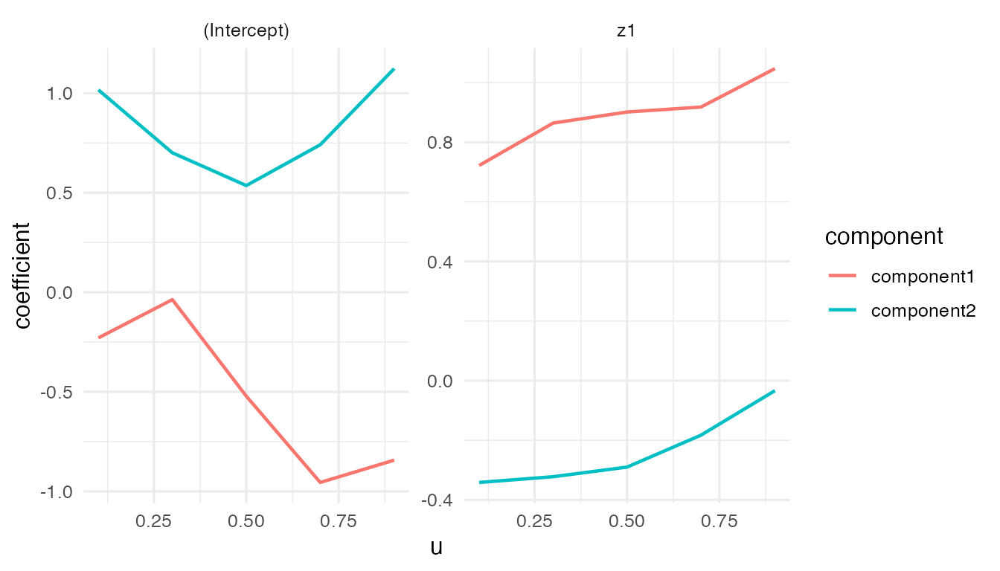
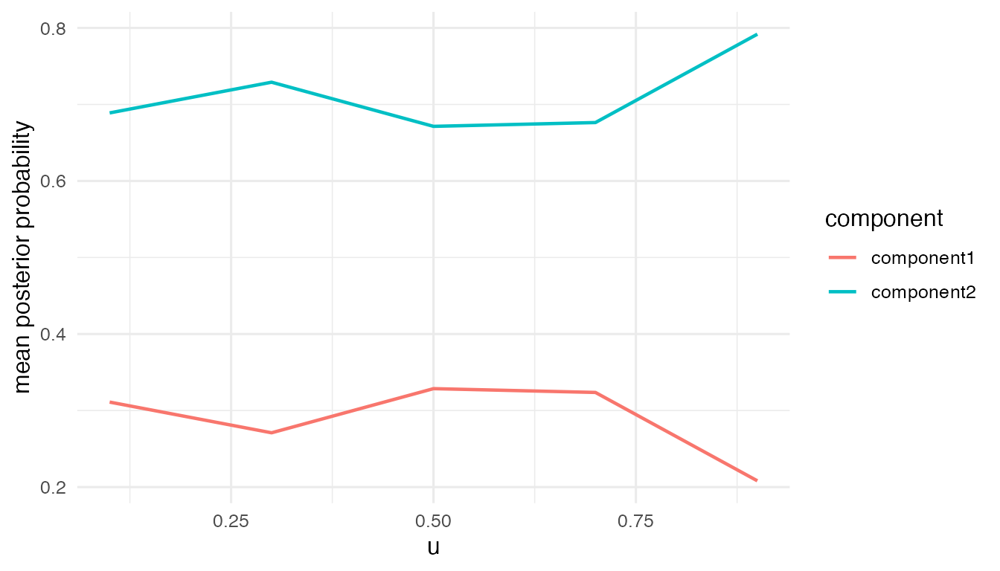

<div id="main" class="col-md-9" role="main">

# Gaussian VCMoE Simulation Tutorial

This vignette shows the basic steps for a Gaussian varying-coefficient
mixture-of-experts model:

1.  install and load `VCMoE`;
2.  simulate a small Gaussian example;
3.  fit `vcmoe_fit()`;
4.  inspect coefficient functions, posterior probabilities, and
    diagnostics.

The example uses `k = 2`, which is the easiest setting for learning the
package API and checking that the label-alignment diagnostics behave as
expected.

<div class="section level2">

## Installation from GitHub

Install the package from GitHub with `remotes`:

<div id="cb1" class="sourceCode">

``` r
install.packages("remotes")
remotes::install_github("qc-zhao/Varying-Coefficient-Mixture-of-Experts-Model")
```

</div>

Then load the package:

<div id="cb2" class="sourceCode">

``` r
library(VCMoE)
```

</div>

</div>

<div class="section level2">

## Simulate Gaussian data

`simulate_vcmoe_gaussian()` returns a data frame and the known truth
used to generate it. The response is Gaussian, while the
component-specific expert coefficients and gating probabilities vary
with the continuous coordinate `u`.

<div id="cb3" class="sourceCode">

``` r
sim <- simulate_vcmoe_gaussian(
  n = 240,
  k = 2,
  seed = 1,
  separation = 1.4,
  scenario = "well_separated"
)

head(sim$data)
#>             y          u         z1         x1 component
#> 1  1.46391885 0.01307758 -0.5059575 -2.5923277         2
#> 2  0.45150293 0.01339033  1.3430388  1.3140022         2
#> 3 -0.07840661 0.02333120 -0.2145794 -0.6355430         1
#> 4 -0.65570670 0.03554058 -0.1795565 -0.4299788         1
#> 5 -0.88436358 0.04646089 -0.1001907 -0.1693183         1
#> 6  0.06568162 0.05893438  0.7126663  0.6122182         1
str(sim$truth, max.level = 1)
#> List of 9
#>  $ expert     : num [1:240, 1:2, 1:2] -0.586 -0.585 -0.551 -0.51 -0.474 ...
#>   ..- attr(*, "dimnames")=List of 3
#>  $ gating     : num [1:240, 1:2, 1:2] -0.27 -0.27 -0.267 -0.263 -0.259 ...
#>   ..- attr(*, "dimnames")=List of 3
#>  $ sigma      : num [1:240, 1:2] 0.351 0.351 0.351 0.352 0.352 ...
#>   ..- attr(*, "dimnames")=List of 2
#>  $ probability: num [1:240, 1:2] 0.156 0.51 0.308 0.33 0.357 ...
#>  $ logits     : num [1:240, 1:2] -0.8444 0.0205 -0.4058 -0.3551 -0.2947 ...
#>  $ mean       : num [1:240, 1:2] -0.912 0.283 -0.691 -0.628 -0.541 ...
#>  $ component  : int [1:240] 2 2 1 1 1 1 1 1 2 2 ...
#>  $ scenario   : chr "well_separated"
#>  $ terms      :List of 2
```

</div>

</div>

<div class="section level2">

## Fit the model

The formula has two parts:

-   `y ~ z1` is the expert mean model;
-   `| x1` is the gating model.

The varying coordinate is supplied separately through `u = "u"`. By
default, `vcmoe_fit()` uses Epanechnikov density weights, a scaled
local-linear basis, and unit scaling of `u`.

<div id="cb4" class="sourceCode">

``` r
fit <- vcmoe_fit(
  y ~ z1 | x1,
  data = sim$data,
  u = "u",
  family = "gaussian",
  k = 2,
  bandwidth = 0.30,
  u_grid = seq(0.1, 0.9, length.out = 5),
  control = list(maxit = 80, n_starts = 2, seed = 2)
)

fit
#> VCMoE fit
#>   family: gaussian
#>   components: 2
#>   label alignment: global
#>   kernel: epanechnikov (density_over_bandwidth)
#>   local basis: (u - u0) / bandwidth
#>   u scale: unit
#>   grid points: 5
#>   bandwidth: 0.3
#>   converged grid points: 5/5
```

</div>

</div>

<div class="section level2">

## Coefficients and predictions

Expert coefficients are returned as an array indexed by grid point,
component, and term. Posterior probabilities are returned with one
column per component.

<div id="cb5" class="sourceCode">

``` r
expert_coef <- coef(fit, "expert")
dim(expert_coef)
#> [1] 5 2 2
expert_coef[, , "z1"]
#>      component
#> u     component1  component2
#>   0.1  0.7219067 -0.34152286
#>   0.3  0.8642307 -0.32224523
#>   0.5  0.9013834 -0.28998022
#>   0.7  0.9180562 -0.18282712
#>   0.9  1.0469837 -0.03351975
```

</div>

<div id="cb6" class="sourceCode">

``` r
posterior <- predict(fit, type = "posterior")
head(posterior)
#>              [,1]         [,2]
#> [1,] 8.922896e-07 9.999991e-01
#> [2,] 7.899766e-01 2.100234e-01
#> [3,] 9.775080e-01 2.249200e-02
#> [4,] 9.999230e-01 7.701971e-05
#> [5,] 9.999901e-01 9.927720e-06
#> [6,] 9.104549e-01 8.954513e-02
rowSums(head(posterior))
#> [1] 1 1 1 1 1 1

fitted_mean <- predict(fit, type = "mean")
head(fitted_mean)
#> [1]  1.1896767  0.7020420 -0.3510114 -0.3587783 -0.3015808  0.3289356
```

</div>

</div>

<div class="section level2">

## Diagnostics

Always inspect diagnostics before interpreting coefficient functions.
The most important early checks are grid convergence, label ambiguity,
component proportions, posterior entropy, and effective local sample
size.

<div id="cb7" class="sourceCode">

``` r
diagnostics <- vcmoe_diagnostics(fit)
diagnostics[, c("u", "converged", "ambiguous", "posterior_entropy", "effective_n")]
#>     u converged ambiguous posterior_entropy effective_n
#> 1 0.1      TRUE     FALSE         0.2123831    77.73469
#> 2 0.3      TRUE     FALSE         0.2262570   123.66422
#> 3 0.5      TRUE     FALSE         0.2086574   131.44235
#> 4 0.7      TRUE     FALSE         0.1471565   122.84420
#> 5 0.9      TRUE     FALSE         0.1160909    82.69806
```

</div>

</div>

<div class="section level2">

## Plots

`plot_coefficients()` shows the fitted coefficient functions. For a
simulated example, the plot is mainly a quick visual check that the
fitted paths are smooth and labels remain connected across the grid.

<div id="cb8" class="sourceCode">

``` r
plot_coefficients(fit, "expert")
```

</div>



`plot_posterior()` summarizes posterior component probabilities over
`u`.

<div id="cb9" class="sourceCode">

``` r
plot_posterior(fit)
```

</div>



</div>

<div class="section level2">

## Optional: bandwidth selection

For real analyses, bandwidth should usually be selected rather than
fixed by hand. The cross-validation selector uses held-out predictive
log-likelihood and returns a final refit by default.

<div id="cb10" class="sourceCode">

``` r
selection <- vcmoe_select_bandwidth(
  y ~ z1 | x1,
  data = sim$data,
  u = "u",
  family = "gaussian",
  k = 2,
  bandwidth_grid = c(0.24, 0.30, 0.36),
  folds = 3,
  u_grid = seq(0.1, 0.9, length.out = 5),
  control = list(maxit = 80, n_starts = 2, seed = 3),
  seed = 4
)

selection
selection$best_bandwidth
```

</div>

</div>

</div>
